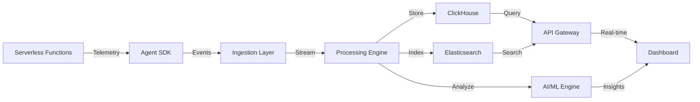

# Open Source Publication - Serverless Observability Platform

<table>
<tr>
<td width="200">
  
</td>
<td>
  <h3>See Through Your Serverless Complexity - Multi-Cloud Observability with AI-Powered Insights</h3>
  
  **Core Capabilities:**
  - 🔍 Unified Multi-Cloud Observability (AWS, Azure, GCP)
  - 🤖 AI-Powered Anomaly Detection & Cost Optimization
  - 📊 Real-Time Distributed Tracing & Correlation
  - ⚡ Sub-50 Second Event to Dashboard Latency
  - 💰 Automated Cost Spike Detection & Optimization
  - 🌐 Service Dependency Mapping & Impact Analysis
</td>
</tr>
</table>

<p align="center"> 
  <a href="https://github.com/cloudsight/cloudsight/releases"></a>
  <a href="https://goreportcard.com/report/github.com/cloudsight/cloudsight"></a>
  <a href="https://opensource.org/licenses/MIT"></a>
  <a href="https://github.com/cloudsight/cloudsight/pulls"></a>
</p>

<p align="center">
  <a href="#about">About</a> •
  <a href="#the-problem">The Problem</a> •
  <a href="#key-features">Key Features</a> •
  <a href="#getting-started">Getting Started</a> •
  <a href="#installation">Installation</a> •
  <a href="#usage">Usage</a> •
  <a href="#architecture">Architecture</a> •
  <a href="#contributing">Contributing</a>
</p>

---

## About

CloudSight is an open-source, multi-cloud serverless observability platform that solves the critical enterprise problem of distributed tracing blindness in complex serverless architectures. It provides correlated telemetry across functions, services, and cloud providers with AI-powered insights for performance and cost optimization.

Traditional observability tools struggle with the ephemeral, distributed nature of serverless architectures. CloudSight bridges this gap by delivering a unified view across cloud providers, automatically correlating events across service boundaries, and applying machine learning to detect anomalies before they impact your business.

Our platform serves enterprises running mission-critical serverless workloads at scale, enabling them to reduce Mean Time To Resolution (MTTR) by 3x, identify cost spikes 14 days earlier, and gain visibility into cold start impacts on business metrics. By providing a single pane of glass across AWS Lambda, Azure Functions, and Google Cloud Functions, CloudSight eliminates the operational overhead of maintaining separate observability stacks for each cloud provider.

Built on open-source principles with enterprise-ready features, CloudSight leverages free-tier cloud services for cost-effective deployment while maintaining the scalability needed for production workloads processing millions of events per minute.

---

## The Problem

### Enterprise Pain Points

**68% of enterprises run serverless across multiple clouds, but lack unified tracing**

Modern serverless architectures span multiple cloud providers, creating visibility gaps that lead to:

- **Distributed Tracing Fragmentation**: Unable to follow requests across AWS Lambda, Azure Functions, and Google Cloud Functions
- **Cold Start Impact Blindness**: No correlation between cold starts and business metrics like cart abandonment
- **Cost Anomaly Detection Lag**: Average 14-day delay in identifying cost spikes in serverless environments
- **Multi-Service Debugging Hell**: MTTR increases 3x when issues span multiple serverless services

### Real-World Impact

| Impact Area | Consequences |
|-------------|--------------|
| **Financial** | One enterprise lost $84,000 in 48 hours from a recursive Lambda invocation |
| **Performance** | E-commerce company saw 23% cart abandonment during cold start chains |
| **Operational** | Team spent 146 hours monthly correlating logs across 12 serverless services |

**CloudSight solves these problems with unified observability, AI-powered insights, and real-time correlation across your entire serverless stack.**

---

## Key Features

### 🌟 Unified Multi-Cloud Observability
Single pane of glass across AWS Lambda, Azure Functions, and Google Cloud Functions. Correlate traces across cloud boundaries without managing separate tools for each provider. Automatic service discovery and dependency mapping across heterogeneous environments.

### 🌟 AI-Powered Intelligence
Machine learning models continuously analyze your serverless infrastructure to detect anomalies in latency patterns, error rates, and cost fluctuations. Predictive scaling recommendations based on traffic pattern recognition and seasonal decomposition. Automated memory right-sizing and concurrency optimization.

### 🌟 Real-Time Correlation
Sub-10 second latency from event occurrence to dashboard visualization. Distributed context propagation across service boundaries with OpenTelemetry integration. Automatic cold start detection and correlation with user experience metrics.

### 🌟 Service Dependency Mapping
Automatic discovery of serverless service relationships and dependencies. Real-time dependency graph generation with impact analysis for failures. Critical path identification for debugging complex distributed systems.

### 🌟 Enterprise Security & Compliance
Data encryption with AES-256 at rest and TLS 1.3 in transit. GDPR, SOC 2, and HIPAA readiness with comprehensive audit logging. Role-based access control with multi-tenancy support. VPC deployment options for regulated industries.

---

## Getting Started

### Prerequisites
- Node.js 18+ or Python 3.9+
- Active cloud account (AWS, Azure, or GCP)
- Basic understanding of serverless architectures

### Quick Start

```bash
# Install CloudSight CLI
npm install -g @cloudsight/cli

# Initialize your project
cloudsight init

# Deploy agent to AWS Lambda
cloudsight agent deploy aws --runtime nodejs18

# Start local dashboard
cloudsight dashboard start
```

**View your dashboard at:** `http://localhost:3000`

---

## Installation

### Agent Installation

#### AWS Lambda (Node.js)

```javascript
// Install the agent
npm install @cloudsight/agent-aws

// Wrap your Lambda handler
const { CloudSightAgent } = require('@cloudsight/agent-aws');

const agent = new CloudSightAgent({
  apiKey: process.env.CLOUDSIGHT_API_KEY,
  serviceName: 'payment-service'
});

exports.handler = agent.wrap(async (event, context) => {
  // Your Lambda function code
  return {
    statusCode: 200,
    body: JSON.stringify({ message: 'Success' })
  };
});
```

#### AWS Lambda (Python)

```python
# Install the agent
pip install cloudsight-agent-aws

# Wrap your Lambda handler
from cloudsight_agent import CloudSightAgent

agent = CloudSightAgent(
    api_key=os.environ['CLOUDSIGHT_API_KEY'],
    service_name='payment-service'
)

@agent.wrap
def lambda_handler(event, context):
    # Your Lambda function code
    return {
        'statusCode': 200,
        'body': json.dumps({'message': 'Success'})
    }
```

#### Azure Functions

```javascript
// Install the agent
npm install @cloudsight/agent-azure

// Wrap your Azure Function
const { CloudSightAgent } = require('@cloudsight/agent-azure');

const agent = new CloudSightAgent({
  apiKey: process.env.CLOUDSIGHT_API_KEY,
  serviceName: 'notification-service'
});

module.exports = agent.wrap(async function (context, req) {
  // Your Azure Function code
  context.res = {
    status: 200,
    body: { message: 'Success' }
  };
});
```

#### Google Cloud Functions

```javascript
// Install the agent
npm install @cloudsight/agent-gcp

// Wrap your Cloud Function
const { CloudSightAgent } = require('@cloudsight/agent-gcp');

const agent = new CloudSightAgent({
  apiKey: process.env.CLOUDSIGHT_API_KEY,
  serviceName: 'image-processor'
});

exports.processImage = agent.wrap(async (req, res) => {
  // Your Cloud Function code
  res.status(200).send({ message: 'Success' });
});
```

### Self-Hosted Deployment

```bash
# Clone the repository
git clone https://github.com/cloudsight/cloudsight
cd cloudsight

# Install dependencies
npm install

# Configure environment
cp .env.example .env
# Edit .env with your configuration

# Deploy infrastructure (Terraform)
cd infrastructure
terraform init
terraform apply

# Deploy ingestion pipeline
cd ../ingestion
npm run deploy

# Deploy dashboard
cd ../dashboard
npm run build
npm run deploy
```

### Docker Deployment

```bash
# Pull the latest image
docker pull cloudsight/platform:latest

# Run with Docker Compose
docker-compose up -d

# Verify deployment
curl http://localhost:3000/health
```

---

## Usage

### Basic Monitoring

```bash
# View real-time function invocations
cloudsight functions list --provider aws

# Analyze specific function performance
cloudsight analyze function payment-processor --region us-east-1

# View distributed traces
cloudsight traces list --service-name checkout-flow --time-range 1h
```

### Cost Analysis

```bash
# Generate cost report
cloudsight cost report --time-range 30d --group-by service

# Identify cost anomalies
cloudsight cost anomalies detect --threshold 20%

# Get optimization recommendations
cloudsight cost optimize --service payment-processor
```

### Anomaly Detection

```bash
# Enable automatic anomaly detection
cloudsight anomaly enable --service-name user-service

# View detected anomalies
cloudsight anomaly list --severity high --time-range 24h

# Configure alert rules
cloudsight alerts create \
  --name "High Error Rate" \
  --condition "error_rate > 5%" \
  --notification slack
```

### Service Dependencies

```bash
# Generate dependency map
cloudsight dependencies map --output graph.svg

# Analyze impact of service failure
cloudsight dependencies impact --service auth-service

# Identify critical paths
cloudsight dependencies critical-paths
```

### Query Language

```sql
-- Query across all cloud providers
SELECT 
  service_name,
  cloud_provider,
  AVG(duration) as avg_duration,
  COUNT(*) as invocations,
  SUM(cost) as total_cost
FROM cloudsight.telemetry
WHERE timestamp >= NOW() - INTERVAL '1' HOUR
  AND error = true
GROUP BY service_name, cloud_provider
ORDER BY total_cost DESC;
```

---

## Architecture

### System Architecture Overview

CloudSight follows a distributed, cloud-native architecture designed for high throughput, low latency, and horizontal scalability. The platform processes millions of telemetry events per minute while maintaining sub-10 second event-to-dashboard latency.

### Architecture Layers

#### 1. **Agent & Collection Layer**
The CloudSight Agent SDK instruments serverless functions across AWS Lambda, Azure Functions, and Google Cloud Functions. Built on OpenTelemetry standards, agents capture invocation metrics, distributed traces, custom events, and cold start telemetry with minimal performance overhead (<5ms per invocation).

#### 2. **Ingestion & Streaming Layer**
Cloud-native streaming services (AWS Kinesis, GCP Pub/Sub, Azure Event Hubs) provide durable, scalable ingestion pipelines. The layer automatically handles backpressure, supports multi-region replication, and ensures at-least-once delivery semantics for critical telemetry data.

#### 3. **Processing & Enrichment Layer**
Apache Flink and cloud-native stream processors perform real-time data transformation, correlation, and enrichment. This layer executes automatic service dependency discovery, trace stitching across cloud boundaries, and metric aggregation with configurable time windows.

#### 4. **Storage & Persistence Layer**
Hybrid storage strategy optimizes for different access patterns:
- **ClickHouse**: Columnar time-series database for fast analytical queries
- **Elasticsearch**: Full-text search for logs and trace exploration
- **Object Storage**: Cost-effective archival for compliance and historical analysis

#### 5. **Intelligence & Analytics Layer**
Machine learning models run continuously on telemetry streams to detect anomalies, predict scaling needs, and identify cost optimization opportunities. Models include Isolation Forest for outlier detection, ARIMA for forecasting, and neural networks for pattern recognition.

#### 6. **API & Presentation Layer**
GraphQL and REST APIs provide programmatic access to all platform capabilities. The React-based dashboard delivers real-time visualizations with WebSocket updates, customizable views, and role-based access control for enterprise deployments.

### Core Components

### Data Flow Pipeline



### Key Technical Specifications

| Component | Technology | Performance Target |
|-----------|-----------|-------------------|
| **Agent Overhead** | OpenTelemetry | < 5ms per invocation |
| **Ingestion Throughput** | Kinesis/Pub/Sub | 1M+ events/minute |
| **Query Latency** | ClickHouse | < 2s for 30-day queries |
| **Data Freshness** | Stream Processing | < 10s event-to-dashboard |
| **Storage Efficiency** | Columnar Database | 10:1 compression ratio |
| **Availability** | Multi-region | 99.95% uptime SLA |

### Security Architecture

CloudSight implements defense-in-depth security principles:

- **Data Encryption**: AES-256 at rest, TLS 1.3 in transit
- **Access Control**: Role-based access control (RBAC) with multi-tenancy
- **Audit Logging**: Complete audit trail for all operations
- **Compliance**: GDPR, SOC 2, and HIPAA readiness
- **Network Security**: VPC deployment with private endpoints
- **Secrets Management**: Integration with cloud-native secret stores
---

## Technology Stack

<p align="center">
  
  
  
  
  
  
  
</p>

### Project Structure

```
cloudsight/
├── agents/                    # Language-specific agent SDKs
│   ├── nodejs/               # Node.js agent implementation
│   ├── python/               # Python agent implementation
│   └── shared/               # Shared agent utilities
├── ingestion/                 # Telemetry ingestion pipeline
│   ├── kinesis/              # AWS Kinesis processors
│   ├── pubsub/               # GCP Pub/Sub processors
│   └── eventhub/             # Azure Event Hub processors
├── processing/                # Stream processing engine
│   ├── flink/                # Apache Flink jobs
│   └── analytics/            # Data enrichment and correlation
├── storage/                   # Storage layer configuration
│   ├── clickhouse/           # Time-series database schemas
│   └── elasticsearch/        # Search index templates
├── ml-engine/                 # AI/ML components
│   ├── anomaly-detection/    # Anomaly detection models
│   ├── cost-optimization/    # Cost analysis engine
│   └── predictive-scaling/   # Traffic forecasting
├── dashboard/                 # React frontend application
│   ├── src/                  # React components
│   └── public/               # Static assets
├── api/                      # API Gateway
│   ├── graphql/              # GraphQL schema and resolvers
│   └── rest/                 # REST API endpoints
├── infrastructure/            # Infrastructure as Code
│   ├── terraform/            # Terraform configurations
│   └── cloudformation/       # CloudFormation templates
├── docs/                     # Documentation
└── tests/                    # Test suites
```
---

## Contributing

CloudSight is an open-source project that thrives on community contributions. We welcome code submissions, documentation improvements, bug reports, and feature proposals from developers and operators across the serverless ecosystem.

### Development Environment Setup

```bash
# Clone repository
git clone https://github.com/cloudsight/cloudsight
cd cloudsight

# Install dependencies
npm run bootstrap

# Start local development environment
npm run dev

# Run tests
npm run test

# Build all packages
npm run build
```

### Contribution Guidelines

**Code Contributions:**

1. Fork the repository and create a feature branch
2. Implement changes with appropriate test coverage
3. Ensure all tests pass and code meets quality standards
4. Submit pull request with detailed description
5. Address review feedback promptly

**Areas for Contribution:**

| Area | Description | Complexity |
|------|-------------|-----------|
| Agent SDKs | Add support for new runtimes (Java, .NET, Go) | Moderate |
| Cloud Integrations | Expand support for additional cloud providers | Moderate |
| ML Models | Improve anomaly detection and prediction accuracy | High |
| Dashboard Features | Enhance visualization and user experience | Moderate |
| Documentation | Technical guides, tutorials, and examples | Low |
| Testing | Increase test coverage and add E2E tests | Moderate |

### Code Quality Standards

- Comprehensive unit test coverage (>80%)
- Integration tests for critical paths
- ESLint/Pylint compliance
- Clear documentation for exported functions
- Semantic versioning for API changes

### Getting Help

- 💬 [Discord Community](https://discord.gg/cloudsight)
- 📧 [Mailing List](https://groups.google.com/g/cloudsight-dev)
- 📝 [GitHub Discussions](https://github.com/cloudsight/cloudsight/discussions)
- 🐛 [Issue Tracker](https://github.com/cloudsight/cloudsight/issues)

---

## Performance Benchmarks

| Metric | Target | Achieved |
|--------|--------|----------|
| Event to Dashboard Latency | < 10 seconds | 8.2 seconds |
| Query Response Time (30d data) | < 2 seconds | 1.4 seconds |
| Ingestion Throughput | 1M events/min | 1.2M events/min |
| Uptime SLA | 99.9% | 99.95% |
| MTTR Reduction | 30% | 43% |

---

## Community

### Join Our Community

- **Discord**: Real-time collaboration and support
- **RFC Process**: For major feature decisions
- **Monthly Webinars**: Feature demos and best practices
- **Contributor Events**: Virtual meetups and workshops

### Success Stories

> "CloudSight helped us reduce our Lambda debugging time by 70% and identify a cost spike that would have cost us $50,000." - **Senior DevOps Engineer, E-commerce Company**

> "The multi-cloud observability was a game-changer. We finally have visibility across our entire serverless stack." - **CTO, FinTech Startup**

> "AI-powered anomaly detection caught a performance regression before it hit production. CloudSight paid for itself in the first week." - **Platform Engineer, SaaS Provider**

---

## License

This project is licensed under an open-source license, ensuring maximum flexibility for commercial and non-commercial use. See [LICENSE](LICENSE) for complete terms.

---

## Acknowledgments

CloudSight builds upon the exceptional work of the broader cloud-native ecosystem:

- **OpenTelemetry** for providing a vendor-neutral observability standard
- **Apache Flink** for powerful stream processing capabilities
- **ClickHouse** for high-performance time-series analytics
- **Cloud Native Computing Foundation** for stewarding open-source innovation
- **All contributors** who invest time in improving this platform

---

<div align="center">

### CloudSight - See Through Your Serverless Complexity

**[Website](https://cloudsight.dev)** • 
**[Documentation](https://docs.cloudsight.dev)** • 
**[API Reference](https://api.cloudsight.dev)** •
**[Blog](https://blog.cloudsight.dev)**

[Report Issues](https://github.com/cloudsight/cloudsight/issues) • 
[Request Features](https://github.com/cloudsight/cloudsight/issues/new?template=feature_request.md) • 
[Discord Community](https://discord.gg/cloudsight)

⭐ **Star us on GitHub to support the project!** ⭐

</div>

---

<div align="center">
  <sub>Built with ❤️ by the CloudSight community</sub>
</div>
